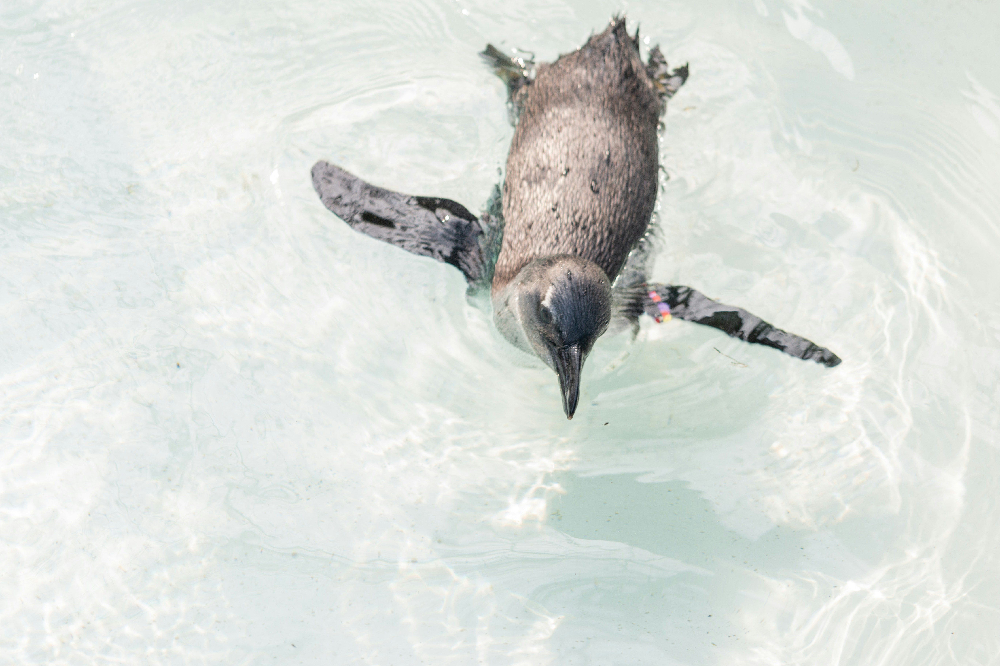

<!DOCTYPE html>
<html>
<head>
<title> Penguins </title>
</head>
<body>
<h1 style= "font-size":300%> 
Penguins </h1>
<h2>Birds that can't fly?</h2>

 Penguins lack the ability to fly because their wings are used to cut through water. As penguins evolved they developed shorter and denser wing structures to suit their environment. This leads their wings to serve more as powerful flippers allowing gracefully swim through water. 

</body>
</html>
